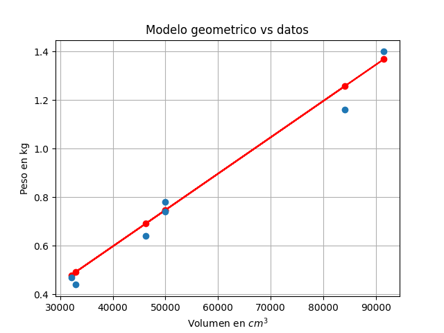

[](https://classroom.github.com/a/jw8MUQHd)
[](https://classroom.github.com/open-in-codespaces?assignment_repo_id=23030697)
# Práctica 5: Modelos De Similitud Geométrica
 El Problema del Campeonato de Pesca De Róbalo

En esta practica vamos a (intentar) construir un modelo para estimar el peso de un róbalo usando únicamente medidas que pueden obtenerse con una cinta métrica. El problema surge en el contexto de un campeonato de pesca, donde interesa estimar el peso de los peces sin necesidad de pesarlos directamente. 

La práctica parte de varios supuestos:

* Todos los peces son de la misma especie: róbalo

* La densidad de los peces se considera constante

* Se ignoran otros factores como edad, sexo o estación del año

* se asume que los róbalos son geométricamente similares

A partir de estas ideas, se deduce que el peso es proporcional al volumen y que el volumen se relaciona con el cubo de una longitud característica.


## Integrantes

- Galeana Morán Miguel Ángel
- García Chalche Julio César
- Sáchez García Rafael


## Uso e instalación

Se ejecuta directamente el `main.py` 

- `matplotlib`

(Si no eliminas esta línea lloro) Y dime cómo debería ejecutar tu código y en qué orden. Recuerda que antes de ejecutar tu código leeré tu `README.md`. Por ejemplo la manera en la que propongo que organizes tu código es

- `main.py`: Contiene el código para graficar cada uno de los tres ejercicios
- `` (Por favor modifica esta línea)

## Ejercicio 1

Ajuste del Modelo de Peso en Pescados

Planteamiento: Para poder ajustar nuestro modelo necesitamos datos sobre el peso ($W$) y la longitud ($l$) de algunos pescados. Los únicos datos sobrevivientes de los campeonatos anteriores se
encuentran en la siguiente tabla:


| Medida | Pez 1 | Pez 2 | Pez 3 | Pez 4 | Pez 5 | Pez 6 | Pez 7 |
| ------ | ----- | ----- | ----- | ----- | ----- | ----- | ----- |
| Longitud (cm) | 36.81 | 31.77 | 43.82 | 36.82 | 32.07 | 45.07 | 35.89 |
| Peso (kg) | 0.78 | 0.47 | 1.16 | 0.74 | 0.44 | 1.40 | 0.64 |

La relación que buscamos modelar es:

$$W \propto l^3$$

Esto implica que el peso es proporcional al volumen del pescado, asumiendo una densidad constante.

<p align="center">
  
</p>

La tendencia lineal confirma que existe una relación de proporcionalidad directa entre el peso ($W$) y el cubo de la longitud ($l^3$). Esto significa que el peso aumenta exactamente en la misma proporción en que aumenta el volumen teórico del pez ($l^3$).

+ Cumplimiento de la Similitud Geométrica

Esta alineación valida el supuesto de que los ejemplares de la especie (en este caso, los róbalos) son geométricamente similares, a pesar de tener diferentes tamaños, todos mantienen esencialmente la misma forma y proporciones.

Si los peces cambiaran radicalmente de forma al crecer (por ejemplo, si se volvieran mucho más anchos proporcionalmente), los puntos se desviarían de la línea recta.

+ Consistencia en la Densidad

El hecho de que los puntos no estén dispersos al azar sugiere que el supuesto de densidad constante es razonable para este modelo inicial. Como el peso se define como $W=V⋅ρ$ , una línea recta indica que la densidad ($ρ$) no varía significativamente entre un pez pequeño y uno grande.

## Ejercicio 2
Utiliza los datos anteriores y el método de tu preferencia para estimar un buen valor de \(K\) para nuestro modelo de similaridad geométrica

\[
W = K l^3
\]

Grafica la estimación contra los datos.  

**Preguntas:**
- ¿Qué tan bueno es el ajuste?
- ¿Hay algún efecto que nuestro modelo no capture?

---

### Hint

Usa la librería `numpy`.

```python
import numpy as np

a = np.array([1, 2, 3])

print(np.sum(a))
print(a**2)


## Ejercicio 3

Planteamiento: Ahora añadiremos una dimensión extra a nuestra tabla anterior. Supongamos que además
de los datos anteriores también tenemos disponible la circunferencia máxima de cada pez
Realice el ajuste del nuevo modelo en términos de la circunferencia ¿Cómo queda la
fórmula explicita del modelo?¿Qué tan bueno es el ajuste?

Para esta solucion considera la Tabla siguiente: 

| Medida | Pez 1 | Pez 2 | Pez 3 | Pez 4 | Pez 5 | Pez 6 | Pez 7 |
| ------ | ----- | ----- | ----- | ----- | ----- | ----- | ----- |
| Longitud (cm) | 36.81 | 31.77 | 43.82 | 36.82 | 32.07 | 45.07 | 35.89 |
| Peso (kg) | 0.78 | 0.47 | 1.16 | 0.74 | 0.44 | 1.40 | 0.64 |
| Circunferencia máxima (cm) | 31.00 | 29.50 | 35.70 | 31.10 | 28.80 | 38.10 | 30.50 |

A partir de los nuevos supuestos,

$$V \propto l_e A_{prom}, \quad l_e \propto l, \quad A_{prom} \propto A_{max}$$

y usando que

$$C = 2\pi r,$$

se tiene que

$$A_{max} = \pi r^2 = \frac{C^2}{4\pi}.$$

Por tanto,

$$A_{max} \propto C^2,$$

y entonces:

$$V \propto l C^2.$$

Para el nuevo modelo se considera que el peso del pez es proporcional a su volumen y que dicho volumen puede aproximarse mediante la longitud y la circunferencia máxima.

El modelo propuesto es:

$$
W = K\ l\ C^2
$$

donde:

- $W$ es el peso del pez
- $l$ es la longitud del pez
- $C$ es la circunferencia máxima
- $K$ es una constante que se estima con los datos

Para ajustar el modelo se define:

$$
x_i = l_i\ C_i^2
$$

y se calcula $K$ por mínimos cuadrados con la fórmula:

$$
K = \frac{\sum (x_i W_i)}{\sum (x_i^2)}
$$

Con los datos de la tabla se obtuvo:

$$
K \approx 2.0502 \times 10^{-5}
$$

Por lo tanto, la fórmula explícita del modelo queda:

$$
W \approx 2.0502 \times 10^{-5}\ l\ C^2
$$

Los pesos estimados con este modelo son cercanos a los pesos reales, por lo que el ajuste puede considerarse bueno. Esto indica que, en esta muestra, incorporar la circunferencia máxima mejora la estimación del peso, ya que permite distinguir mejor entre peces más delgados y peces más anchos.


## Conclusión

(Por favor modifica esta línea bro, es la última que tienes que modificar bro, por favor bro) Es buena práctica concluir tus prácticas. ¿Qué te llevas? ¿Sientes que fue relevante para ti? ¿Se te complicó algún aspecto? ¿Hubo algún resultado que contradijera tu intuición? 

---

[^1]: Sólo soy una nota al pie, elimíname bro, por favor bro.
